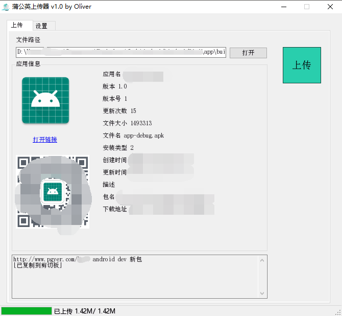
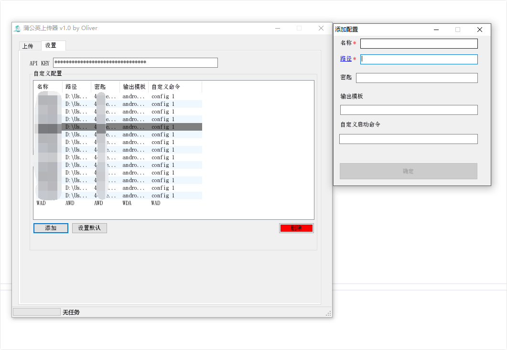

# PgyerManager/蒲公英管理器
用蒲公英开放API做的一个上传应用PC程序，您只需要打包完成后，通过Studio的Terminal输入```pgyer -c [您自定义的命令]``` 即可上传到您的蒲公英上面

链接和您自定义的模板自动复制到剪贴板，解放双手

您也可以打开程序主页面进行上传配置等等

这个软件我会陆续添加一些功能，当然也可能使用Python或者Java来重构，毕竟苹果系统可不支持C# WinForm啊！

>我的生活中，我经常会用一些脚本（可能是WinForm\Python\Java\Auto.js\按键精灵\Linux Bash\Windows CMD）来代替繁琐的操作步骤，我喜欢这样


## 当前版本 v1.0.0


### <主页面/>




### 配置页面



## <使用说明/>

[说明我会上的别急]